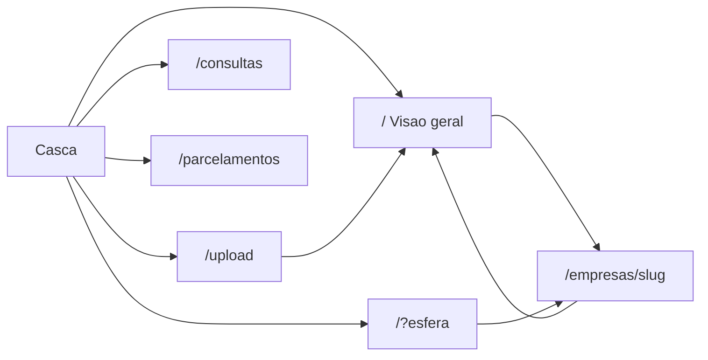

# Catálogo visual das telas — Relação de Débitos

| Item | Valor |
|------|--------|
| Fonte de regras | [DOCUMENTACAO-SISTEMA.md](DOCUMENTACAO-SISTEMA.md) |
| Código da UI | `2. RELAÇÃO DE DEBITOS/dashboard` |
| Última atualização | 23/09/2026 (layout Êxito) |

Este arquivo descreve **como cada tela está montada** (wireframe ASCII) e **o que cada botão, link, seletor e controle faz**. Não substitui as regras de negócio — para critérios de Excel, teto de parcelas, importação etc., use a documentação oficial.

## Índice

1. [Casca comum](#1-casca-comum-todas-as-rotas)
2. [Visão geral `/`](#2-visão-geral--)
3. [Esferas (`/?esfera=`)](#3-esferas--esfera)
4. [Detalhe da empresa](#4-detalhe-da-empresa--empresasslug)
5. [Importar PDFs `/upload`](#5-importar-pdfs-upload)
6. [Consultas `/consultas`](#6-consultas-consultas)
7. [Parcelamentos `/parcelamentos`](#7-parcelamentos-parcelamentos)
8. [Mapa de navegação](#8-mapa-de-navegação)
9. [Padrão visual Êxito](#9-padrão-visual-êxito)

---

## 1. Casca comum (todas as rotas)

**Código:** `dashboard/src/app/layout.tsx`, `ShellFrame.tsx`, `AppTopBar.tsx`, `SidebarNav.tsx`

```text
┌──────────────────────────────────────────────────────────────────────────────┐
│ [≡]* [dashboard][upload][assignment]  RELAÇÃO DE DEBITOS MENSAL  [Comp. ▼]   │  topbar 64px branca, borda #d7e3fd
├───────────────────┬──────────────────────────────────────────────────────────┤
│ [search Pesquisar]│  fundo #f9f9ff                                           │
│ ███ Visão geral ███│  conteúdo da rota                                       │  item ativo: fundo #006b2b, texto branco
│  Importar PDFs    │                                                          │
│  Consultas        │                                                          │
│  Parcelamentos    │                                                          │
│ ESFERAS (eyebrow) │                                                          │
│  Federal          │                                                          │
│  Estadual         │                                                          │
│  Municipal        │                                                          │
└───────────────────┴──────────────────────────────────────────────────────────┘
 sidebar 288px branca     * [≡] só abaixo de 1024px: abre gaveta com overlay rgba(16,28,47,0.4)
```

### Controles da casca

| Controle | O que faz | Destino / efeito | Quando some ou trava |
|----------|-----------|------------------|----------------------|
| Ícone **menu** (☰) | Abre a gaveta do menu | Overlay + sidebar | Só abaixo de 1024px |
| Fundo escuro da gaveta | Fecha o menu | Fecha | Só com gaveta aberta |
| Ícone **Visão geral** (topo) | Atalho para o painel sem filtro de esfera | `/?competencia=MM-YYYY` | Destacado (fundo verde suave) quando a home está sem `esfera` |
| Ícone **Importar PDFs** (topo) | Abre a tela de upload | `/upload?competencia=…` | Destacado em `/upload` |
| Ícone **Consultas** (topo) | Abre o cadastro de consultas | `/consultas?competencia=…` | Destacado em `/consultas` |
| Logo / título **RELAÇÃO DE DEBITOS MENSAL** | Volta à visão geral | `/?competencia=…` | — |
| Seletor **Competência** (topo) | Troca o mês ativo em todas as telas | Atualiza `?competencia=` na URL atual; remove `comparar` se for o mesmo mês | Some se não houver competências cadastradas |
| Campo **Pesquisar** (menu) | Filtra os itens do menu lateral pelo rótulo | Só filtra a lista do menu; não navega | Mensagem “Nenhum item encontrado” se a busca esvaziar a lista |
| **Visão geral** (menu) | Painel completo do mês | `/?competencia=…` | Ativo: fundo verde `#006b2b`, texto branco |
| **Importar PDFs** (menu) | Upload | `/upload?competencia=…` | — |
| **Consultas** (menu) | Cadastro de portais | `/consultas?competencia=…` | — |
| **Parcelamentos** (menu) | Grade operacional de parcelamentos | `/parcelamentos?competencia=…` | — |
| **Federal** (menu Esferas) | Filtra o painel na esfera federal | `/?esfera=federal&competencia=…` | Ativo só na home com essa esfera |
| **Estadual** (menu Esferas) | Filtra o painel na esfera estadual | `/?esfera=estadual&competencia=…` | Idem |
| **Municipal** (menu Esferas) | Filtra o painel na esfera municipal | `/?esfera=municipal&competencia=…` | Idem |

**Nota:** O atalho de Parcelamentos existe no menu lateral; a barra superior não tem ícone de Parcelamentos. Ícones são Material Symbols Outlined.

---

## 2. Visão geral `/`

**Rota:** `/`  
**Código:** `dashboard/src/app/page.tsx`, `EmpresasTable.tsx`, `DashboardOverview.tsx`, `TituloConsolList.tsx`, `PaginationBar.tsx`  
**Casca:** mesma da seção 1.

```text
┌──────────────────────────────────────────────────────────────────────────────┐
│ VISÃO GERAL DOS DEBITOS          [Exportar omissões] [Exportar débitos]     │
│                                  Gerado em dd/mm/aaaa hh:mm                  │
├──────────────────┬──────────────────┬──────────────────┐                     │
│ Empresas   N     │ Com pendência N  │ Regulares    N   │                     │
├──────────────────┼──────────────────┼──────────────────┤                     │
│ ECAC Federal  n  │ Agenci@Net Est n │ Prefeitura Mun n │                     │
├─────────────────────────────┬──────────────────────────┤                     │
│ Saldo por esfera (barras)   │ Risco do portfólio (donut)│                     │
├─────────────────────────────┴──────────────────────────┤                     │
│ Top 10 cobrança  (clique → abre empresa)               │                     │
├────────────────────────────────────────────────────────┤                     │
│ Por título  [cards clicáveis filtrando a tabela]       │                     │
├────────────────────────────────────────────────────────┤                     │
│ Empresas                                                 │                     │
│ [Buscar…] [Limpar título?]  [Todas|Pendência|Regulares]│                     │
│ ┌────┬─────────┬────────┬────────┬──────┬───────┬─────┐│                     │
│ │Cód.│Empresa  │Status  │Esferas │Lanç. │Saldo  │Tipos││                     │
│ │    │+ Site   │        │        │      │       │     ││                     │
│ └────┴─────────┴────────┴────────┴──────┴───────┴─────┘│                     │
│ Linhas [10▼]  1–10 de N     [Anterior] Pág. [Próxima]  │                     │
└────────────────────────────────────────────────────────┘                     │
```

### Controles

| Controle | O que faz | Destino / efeito | Bloqueio / some |
|----------|-----------|------------------|-----------------|
| **Exportar omissões** | Baixa Excel só com omissões (todas as competências) | `GET /api/omissoes/export?formato=xlsx` | — |
| **Exportar débitos** | Baixa Excel só com débitos monetários | `GET /api/debitos/export?formato=xlsx` | — |
| Cards KPI (Empresas / Com pendência / Regulares) | Só exibem totais | Sem clique | — |
| Mini-cards ECAC / Agenci@Net / Prefeitura | Só exibem contagem de documentos | Sem clique; escurecem quando outra esfera está filtrada | — |
| Gráficos Saldo / Risco | Visualização | Tooltip no hover | Empty: “Sem valores…” / “Sem dados…” |
| Item do **Top 10 cobrança** | Abre o detalhe da empresa | `/empresas/{id}` | Lista vazia: “Sem dados…” |
| Card **Por título** | Filtra a tabela de empresas por aquele título | Atualiza filtro interno + URL `?titulo=` (via estado da tabela) | No detalhe da empresa o mesmo gráfico **não** filtra (só exibe) |
| Link de empresa dentro do card de título | Abre a empresa | `/empresas/{id}?competencia=…` | — |
| Campo **Buscar** | Filtra por nome, CNPJ, código, omissão, DCTFWeb, tipo | Filtra a lista local | — |
| **Limpar título** | Remove o filtro de título ativo | Limpa `titulo` da URL | Só aparece quando há título filtrado |
| **Todas** | Mostra todas as empresas | `status` removido da URL | — |
| **Pendência** | Só empresas com pendência | `?status=pendencia` | — |
| **Regulares** | Só empresas regulares | `?status=regular` | — |
| Cabeçalhos da tabela (Cód., Empresa, Status, Lanç., Saldo, Tipos) | Ordena a coluna | Toggle asc/desc | Coluna Esferas não ordena |
| Nome da empresa / CNPJ | Abre o detalhe | `/empresas/{id}?competencia=…` | — |
| Botão **Site** (ex.: PGFN, e-CAC) | Abre o portal de emissão em nova aba | URL do parcelamento ou portal padrão do tipo | Some se não houver site/tipo resolvido |
| Clique nas demais células da linha | Abre o detalhe (mesmo link) | `/empresas/{id}?competencia=…` | — |
| Seletor **Linhas** (10 / 25 / 50) | Muda o tamanho da página | Paginação local | — |
| **Anterior** / **Próxima** | Navega páginas | Paginação local | Desabilitados no início/fim |

### Estados

| Estado | O que aparece |
|--------|----------------|
| Carregando | Texto “Carregando painel…” |
| Dados indisponíveis | Faixa âmbar “Dados indisponíveis: …” |
| Tabela vazia | “Nenhuma empresa encontrada.” |

Regras do Excel: ver [DOCUMENTACAO-SISTEMA.md](DOCUMENTACAO-SISTEMA.md) §6 Painel e §8 Exportar.

---

## 3. Esferas (`/?esfera=`)

**Rotas:** `/?esfera=federal`, `/?esfera=estadual`, `/?esfera=municipal`  
**Código:** mesmos da visão geral; título e KPIs mudam conforme a esfera.

```text
┌──────────────────────────────────────────────────────────────────────────────┐
│ FEDERAL (ou ESTADUAL / MUNICIPAL)   [Exportar omissões] [Exportar débitos]  │
│ KPIs e gráficos filtrados só nesta esfera                                   │
│ Tabela Empresas com Lanç./Saldo da esfera                                   │
└──────────────────────────────────────────────────────────────────────────────┘
```

| Controle | Diferença em relação à visão geral |
|----------|-------------------------------------|
| Título | Nome da esfera em maiúsculas |
| KPIs / gráficos / Top 10 / Por título | Calculados só na esfera ativa |
| Exportar omissões / débitos | Continuam exportando **todas** as competências (não filtram pela esfera da tela) |
| Menu lateral | Item da esfera fica ativo |

---

## 4. Detalhe da empresa `/empresas/[slug]`

**Rota:** `/empresas/{id}?competencia=MM-YYYY&comparar=MM-YYYY` (comparar opcional)  
**Código:** `EmpresaDetail.tsx`, `CompetenciaControls.tsx`, `CompetenciaComparacao.tsx`, `BaixarRelatorioButton.tsx`  
**Casca:** mesma da seção 1.

```text
┌──────────────────────────────────────────────────────────────────────────────┐
│ ← Voltar para o painel                                                       │
│ EMPRESA XYZ · Cód. · CNPJ · Competência                                      │
│   [Site] [Abrir PDF]… [Baixar relatório PDF] [Status]                        │
│ Comparar com: [Nenhuma ▼]                                                    │
│ (avisos âmbar, se houver)                                                    │
│ (bloco comparação, se Comparar ≠ Nenhuma)                                    │
│ (gráfico Por título da empresa)                                              │
│ [Federal n] [Estadual n] [Municipal n]                                       │
│ ┌─ aba ativa ─────────────────────────────────────────────────────────────┐ │
│ │ Status · Diagnóstico fiscal (só Federal, se houver cadastro ECAC)       │ │
│ │ Lançamentos · grade / grupos por título                                 │ │
│ │ Arquivos · [Abrir PDF] [Baixar] [Excluir] por arquivo                   │ │
│ └─────────────────────────────────────────────────────────────────────────┘ │
└──────────────────────────────────────────────────────────────────────────────┘
```

### Controles do cabeçalho

| Controle | O que faz | Destino / efeito | Bloqueio / some |
|----------|-----------|------------------|-----------------|
| **Voltar para o painel** | Retorna à home | `/?competencia=…` ou `/` | — |
| Botão **Site** | Abre portal de emissão | Nova aba | Some se não houver URL |
| **Abrir PDF** (até 3 no cabeçalho) | Abre PDF importado | `/api/pdf/...` em nova aba | Um botão por arquivo (máx. 3 no header) |
| **Baixar relatório PDF** | Gera PDF-resumo da empresa | Download local | Texto vira “Gerando…” enquanto processa |
| Badge de **Status** | Só exibe situação | — | — |
| **Comparar com** | Escolhe outra competência para diff | `?comparar=MM-YYYY` | Desabilitado se houver só 1 competência; opção “Nenhuma” remove o param |

### Controles das abas (Federal / Estadual / Municipal)

| Controle | O que faz | Destino / efeito | Bloqueio / some |
|----------|-----------|------------------|-----------------|
| Aba **Federal / Estadual / Municipal** | Troca o painel da esfera | Conteúdo local (Tabs) | Contador = qtd de documentos |
| Cabeçalhos da grade de lançamentos | Ordenam colunas | Toggle asc/desc | — |
| **Abrir {arquivo}** (estado sem documento) | Abre PDF órfão da esfera | Nova aba | Só se existir arquivo órfão |
| **Abrir PDF** (lista Arquivos) | Abre no navegador | Nova aba | — |
| **Baixar** | Download do PDF | `download` no mesmo arquivo | — |
| **Excluir** | Remove o PDF importado e regenera o painel da empresa | `POST /api/delete-imported` + refresh | Desabilitado enquanto outra exclusão roda; pede confirmação; se for o último arquivo, volta ao painel |

### Wireframe — aba sem documento

```text
┌────────────────────────────────────────────┐
│ Ainda não há documento {esfera}            │
│ Fonte: ECAC / Agenci@Net / Prefeitura      │
│ [Abrir arquivo.pdf]  (se houver órfão)     │
└────────────────────────────────────────────┘
```

### Wireframe — exclusão em andamento

Overlay bloqueante: **Excluindo PDF…** (não fechar nem clicar outra ação).

Regras de diagnóstico fiscal ECAC: [DOCUMENTACAO-SISTEMA.md](DOCUMENTACAO-SISTEMA.md) §6 Detalhe e §8 Diagnóstico fiscal.

---

## 5. Importar PDFs `/upload`

**Rota:** `/upload?competencia=MM-YYYY`  
**Código:** `UploadPanel.tsx`  
**Casca:** mesma da seção 1.

### 5.1 Fase: escolher arquivos (`idle`)

```text
┌──────────────────────────────────────────────────────────────────────────────┐
│ ← Voltar ao painel                                                           │
│ IMPORTAR RELATORIOS                                                          │
│ ┌ Competência ─────────────────────────────────────────────────────────────┐ │
│ │ ☑ Competência existente [MM-YYYY ▼]                                      │ │
│ │ ☐ Nova competência [MM] [YYYY]   Efetiva: MM-YYYY                        │ │
│ └──────────────────────────────────────────────────────────────────────────┘ │
│ ┌ Receita Federal ┐ ┌ Agenci@Net ┐ ┌ Prefeitura ┐                            │
│ │ Arraste PDFs    │ │ Arraste…   │ │ Arraste…   │                            │
│ │ arquivo.pdf [x] │ │            │ │            │                            │
│ └─────────────────┘ └────────────┘ └────────────┘                            │
│ [Analisar N PDF(s)]  [Limpar lista]                                          │
└──────────────────────────────────────────────────────────────────────────────┘
```

### Controles — fase idle

| Controle | O que faz | Destino / efeito | Bloqueio / some |
|----------|-----------|------------------|-----------------|
| **Voltar ao painel** | Volta à home | `/?competencia=…` | Vira texto “Aguarde…” quando `busy` |
| Checkbox **Competência existente** | Usa mês já cadastrado | Habilita o select | Travado na revisão |
| Select de competência | Escolhe MM-YYYY | Estado local | Desabilitado se “Nova competência” ou busy/review |
| Checkbox **Nova competência** | Digita mês/ano novos | Habilita MM e YYYY | Travado na revisão |
| Campos **MM** / **YYYY** | Definem nova pasta | Estado local | Só com “Nova competência” |
| Zona **Receita Federal (ECAC)** | Adiciona PDFs federais | Lista por zona | Aceita só PDF; travada se busy |
| Zona **Agenci@Net (SEFAZ)** | Adiciona PDFs estaduais | Lista por zona | Idem |
| Zona **Prefeitura (Municipal)** | Adiciona PDFs municipais | Lista por zona | Idem |
| **remover** (ao lado do arquivo) | Tira o PDF da lista antes de analisar | Remove da fila | Desabilitado se busy |
| **Analisar N PDF(s)** | Preview dry-run (extrai lançamentos) | `POST /api/ingest` stream | Desabilitado sem arquivos ou se busy |
| **Limpar lista** | Zera arquivos e resultado | Volta a `idle` | Só com arquivos e fase idle/done, sem busy |

### 5.2 Fase: revisão (`review`)

```text
┌──────────────────────────────────────────────────────────────────────────────┐
│ Competência (travada)                                                        │
│ [Confirmar e gravar no painel (N)]  [Cancelar revisão]                       │
│ Faixa: Extração ok… / Nada será gravado…                                     │
│ Revisão antes de gravar                                                      │
│ ┌Incluir┬#┬Arquivo┬Tipo┬Comp.┬Empresa┬Destino┬Lanç.┬Seções┬Saldo┬Status┐    │
│ │  ☑    │ │ …     │    │     │       │       │     │      │     │Dupl. │    │
│ └───────┴─┴───────┴────┴─────┴───────┴───────┴─────┴──────┴─────┴──────┘    │
└──────────────────────────────────────────────────────────────────────────────┘
```

| Controle | O que faz | Destino / efeito | Bloqueio / some |
|----------|-----------|------------------|-----------------|
| Checkbox **Incluir** | Marca PDF para gravar | Seleção local | Só se extração válida + arquivo no inbox; badge Duplicado **não** bloqueia |
| **Confirmar e gravar no painel (N)** | Commit + rebuild da empresa | Stream ingest → home da competência | Desabilitado se N=0 ou busy; rótulo “Nada para gravar” se nenhum marcado |
| **Cancelar revisão** | Descarta o preview e limpa inbox do lote | Volta a escolher arquivos | Desabilitado se busy |

### 5.3 Fase: concluído (`done`)

| Controle | O que faz | Destino / efeito | Bloqueio / some |
|----------|-----------|------------------|-----------------|
| **Excluir o que foi importado (N)** | Remove todos os OK gravados nesta sessão | `POST /api/delete-imported` em lote | Pede confirmação; some se não houver importados |
| **Excluir** (por linha) | Remove só aquele PDF | Mesma API, um arquivo | Só em linhas OK com destino |
| Link **Ver painel · MM-YYYY** | Abre a home da competência | `/?competencia=…` | Só após done com competência |
| **Limpar lista** | Reinicia a tela | `idle` | — |

### Overlay (bloqueia a tela)

| Título | Quando |
|--------|--------|
| Analisando PDFs… | Preview |
| Importando PDFs… | Commit dos arquivos |
| Atualizando o painel (n/total) | Rebuild só da empresa do lote |
| Excluindo PDF… | Exclusão |

Fluxo completo: [DOCUMENTACAO-SISTEMA.md](DOCUMENTACAO-SISTEMA.md) §6 Importar e §8 Importar PDFs.

---

## 6. Consultas `/consultas`

**Rota:** `/consultas`  
**Código:** `ConsultasTable.tsx`  
**Casca:** mesma da seção 1.

```text
┌──────────────────────────────────────────────────────────────────────────────┐
│ EMPRESAS DE CONSULTA                                                         │
│ Cadastro · N empresas · edite a célula e saia do campo para salvar           │
│                                              [status Salvo…] [Nova empresa]  │
│ [Buscar N°, empresa, CNPJ, UF ou portal]                                     │
│ ┌────┬────────┬──────┬────┬─────────┬──────────┬───────────┬────┐            │
│ │ N° │Empresa │CNPJ  │UF  │Federal  │Estadual  │Municipal  │ 🗑 │            │
│ └────┴────────┴──────┴────┴─────────┴──────────┴───────────┴────┘            │
│ Linhas [10▼] …  [Anterior] [Próxima]                                         │
└──────────────────────────────────────────────────────────────────────────────┘
```

### Controles

| Controle | O que faz | Destino / efeito | Bloqueio / some |
|----------|-----------|------------------|-----------------|
| **Nova empresa** | Abre painel lateral | Drawer à direita | — |
| Campo **Buscar** | Filtra o cadastro | Filtro local | — |
| Células editáveis (N°, Empresa, CNPJ, UF, Federal, Estadual, Municipal) | Ao sair do campo, grava | API de cadastro | Municipal desabilitado se UF = DF (“Não tem”) |
| Cabeçalhos | Ordenam a coluna | Toggle | — |
| Ícone lixeira | Remove do cadastro | Confirmação + DELETE | Desabilitado enquanto exclusão daquela linha |
| **Anterior** / **Próxima** / **Linhas** | Paginação | Local | — |

### Wireframe — painel Nova empresa

```text
┌──────────────────────────── fundo escuro ────────────────────┐
│                                              ┌ Nova empresa ┐│
│                                              │ N°            ││
│                                              │ Empresa *     ││
│                                              │ CNPJ          ││
│                                              │ UF | Municipal││
│                                              │ Federal       ││
│                                              │ Estadual      ││
│                                              │ [Cancelar]    ││
│                                              │ [Adicionar]   ││
│                                              │ [X] Fechar    ││
│                                              └───────────────┘│
└──────────────────────────────────────────────────────────────┘
```

| Controle | O que faz | Bloqueio |
|----------|-----------|----------|
| Fundo escuro / **X** / **Cancelar** | Fecha o painel | Travados enquanto “Salvando…” |
| **Adicionar** | Cria a empresa no cadastro | Desabilitado ao salvar; Empresa obrigatória |

### Estados

| Estado | Mensagem |
|--------|----------|
| Cadastro indisponível | Faixa âmbar no topo da página |
| Lista vazia | “Nenhuma empresa no cadastro…” / “Nenhuma empresa encontrada para essa busca.” |

---

## 7. Parcelamentos `/parcelamentos`

**Rota:** `/parcelamentos?competencia=MM-YYYY`  
**Código:** `ParcelamentosPanel.tsx`  
**Casca:** mesma da seção 1.

```text
┌──────────────────────────────────────────────────────────────────────────────┐
│ Parcelamentos · competência MM-YYYY                                          │
│                    [Excel] [PDF] [Gerar competência] [Nova empresa]          │
│ Competência do parcelamento [▼]  [mês] [mês+1] [mês+2]                       │
│ KPIs: Total | Ativo | Encerrado | Erro | Saiu | Cancelado                    │
│ [Buscar…] [Situação▼] [Grupo▼]                                               │
│ Adicionar: [Empresa▼] Total* [ ] Parcela [ ] [Incluir pelo total]            │
│ ┌ Situação|COD|Empresa|Site|Grupo|CNPJ|Tipo|Nº|Parc.|Total|Aberto|…|Ações ┐│
│ │ [▼]     |   |       |btn |    |    |[▼]|  |[ ] |[ ] | calc |  |Salvar ✏ 🗑││
│ └──────────────────────────────────────────────────────────────────────────┘ │
└──────────────────────────────────────────────────────────────────────────────┘
```

### Controles do cabeçalho e competência

| Controle | O que faz | Destino / efeito | Bloqueio / some |
|----------|-----------|------------------|-----------------|
| **Excel** | Exporta a grade do mês | `GET /api/parcelamentos/export` | — |
| **PDF** | Gera PDF da grade filtrada | Download local; overlay “Gerando PDF…” | — |
| **Gerar competência** | Abre/fecha o bloco de criar mês | Toggle `showGerar` | — |
| **Nova empresa** | Abre/fecha o formulário de cadastro | Toggle `showNova` | — |
| Select **Competência do parcelamento** | Troca o mês da grade | `/parcelamentos?competencia=…` | Desabilitado se janela vazia |
| Chips dos 3 meses | Atalho para o mesmo select | Navega para o mês | Destacado o mês ativo |
| Link **Ir para o mês atual** | Volta à janela de 3 meses | Navega | Só se a URL estiver fora da janela |
| Botões **Abrir MM-YYYY** (após salvar cronograma) | Abre mês gerado | Navega e fecha o aviso | — |
| **Fechar** (aviso de cronograma) | Esconde o banner verde | Estado local | — |

### Bloco Gerar competência

| Controle | O que faz | Bloqueio |
|----------|-----------|----------|
| Campo **Nova competência (MM-YYYY)** | Digita o mês a criar | — |
| **Gerar** | Cria competência vazia no JSON | — |
| **Cancelar** | Fecha o bloco | — |

### Bloco Nova empresa

| Controle | O que faz | Bloqueio |
|----------|-----------|----------|
| Campos Empresa*, CNPJ*, Nº, Site, Código, Grupo, Situação, Tipo (checkbox), Vencimento, Total*, Parcela | Montam o acordo | Total obrigatório; CNPJ 14 dígitos; total ≤ 240 |
| **Cadastrar empresa** | POST + PATCH (cronograma) | Valida no cliente e no servidor |
| **Cancelar** | Fecha o formulário | — |

### Bloco Editar empresa (abre pelo lápis)

| Controle | O que faz | Bloqueio |
|----------|-----------|----------|
| Campos identidade (Empresa, CNPJ, Nº, Site, Código, Grupo) | Alteram o catálogo | — |
| **Salvar empresa** | Persiste identidade | — |
| **Cancelar** | Fecha sem salvar | — |

### Filtros e Incluir pelo total

| Controle | O que faz | Bloqueio |
|----------|-----------|----------|
| **Buscar** | Filtra cards | — |
| **Situação: todas** / opções | Filtra por status | — |
| **Grupo: todos** / opções | Filtra por grupo | — |
| Select **Empresa do cadastro** | Escolhe acordo/CNPJ | Lista um item por CNPJ (não some quem já está na grade) |
| **Total *** / **Parcela** | Valores do novo acordo | Total 1–240; parcela ≤ total |
| **Incluir pelo total** | Coloca (ou clona) linha na grade do mês | Desabilitado sem empresa ou sem total |

### Grade — por linha

| Controle | O que faz | Bloqueio |
|----------|-----------|----------|
| Select **Situação** | Ativo / Encerrado / Saiu / Erro na emissão / Cancelado | Só no rascunho até Salvar |
| Botão **Site** | Abre portal | Placeholder “—” se sem URL |
| Select **Tipo** | Municipal, Estadual, PGFN, SN, SN PERT, Outro | Pode preencher vencimento automático |
| Inputs **Parcela atual**, **Total**, **Vencimento**, **Obs** | Editam o rascunho da linha | Total ≤ 240 ao salvar |
| **Salvar** | PATCH sem clonar (edição) | Desabilitado se competência inexistente ou salvando |
| Ícone **lápis** | Abre Editar empresa | — |
| Ícone **lixeira** | Remove só desta grade (mês) | Confirmação; catálogo permanece |

### Estados

| Estado | Mensagem / UI |
|--------|----------------|
| Dados indisponíveis | Faixa âmbar |
| Competência ainda não existe | Faixa âmbar + orientação para Gerar competência |
| Erro de operação | Faixa vermelha |
| Grade vazia | “Nenhuma empresa com parcelamento… Use Nova empresa ou Incluir pelo total” |
| Overlay | Título dinâmico (ex. Gerando PDF…, salvando) |

Regras (teto 240, vários acordos, PATCH): [DOCUMENTACAO-SISTEMA.md](DOCUMENTACAO-SISTEMA.md) §6 Parcelamentos e §7.

---

## 8. Mapa de navegação

```text
Casca (topo + menu)
  ├─ Visão geral (/)
  │    ├─ filtro ?esfera=federal|estadual|municipal
  │    ├─ filtro ?status=pendencia|regular
  │    ├─ filtro ?titulo=…
  │    └─ clique empresa → /empresas/[slug]
  ├─ Importar PDFs (/upload)
  │    └─ após gravar → /?competencia=MM-YYYY
  ├─ Consultas (/consultas)
  ├─ Parcelamentos (/parcelamentos)
  └─ Detalhe (/empresas/[slug])
       └─ Voltar → /
```



---

## 9. Padrão visual Êxito

| Papel | Token / hex | Uso |
|-------|-------------|-----|
| Fundo da página | `#f9f9ff` | Canvas |
| Card | `#ffffff` | Painéis |
| Superfície baixa | `#f0f3ff` | Input, hover suave |
| Superfície média | `#e7eeff` | Hover do menu |
| Borda | `#d7e3fd` | Card, tabela |
| Texto | `#101c2f` | Títulos e corpo |
| Texto secundário | `#536259` | Legenda |
| Verde principal | `#006b2b` | Botão primário, item ativo |
| Verde hover | `#008738` | Hover do primário |
| Verde suave | `#d6e7db` | Sucesso / atalho ativo |
| Perigo | `#b42318` | Erro / destrutivo |

**Regras:** uma ação principal verde por tela; botão secundário = fundo branco + borda `#d1d5db`; input sem borda grossa (fundo `#f0f3ff`, raio 4px, foco anel verde); badges em pílula; sidebar 288px / topbar 64px; abaixo de 1024px a sidebar vira gaveta. Fontes: Inter (texto), Material Symbols Outlined (ícones), JetBrains Mono (código). Tokens em `dashboard/src/app/globals.css` e `lib/exito-palette.ts`.

---

## Onde olhar no código

| Tela | Arquivos principais |
|------|---------------------|
| Casca | `layout.tsx`, `ShellFrame.tsx`, `AppTopBar.tsx`, `SidebarNav.tsx` |
| Tokens / ícones | `globals.css`, `ui/icon.tsx`, `lib/exito-palette.ts` |
| Visão / esferas | `app/page.tsx`, `EmpresasTable.tsx`, `DashboardOverview.tsx` |
| Detalhe | `app/empresas/[slug]/page.tsx`, `EmpresaDetail.tsx` |
| Upload | `app/upload/page.tsx`, `UploadPanel.tsx` |
| Consultas | `app/consultas/page.tsx`, `ConsultasTable.tsx` |
| Parcelamentos | `app/parcelamentos/page.tsx`, `ParcelamentosPanel.tsx` |
